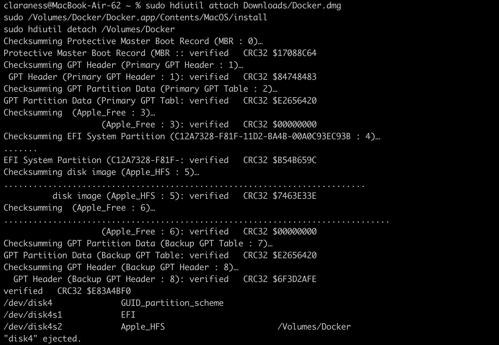
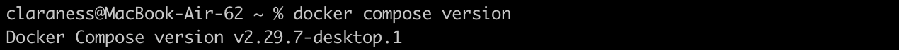
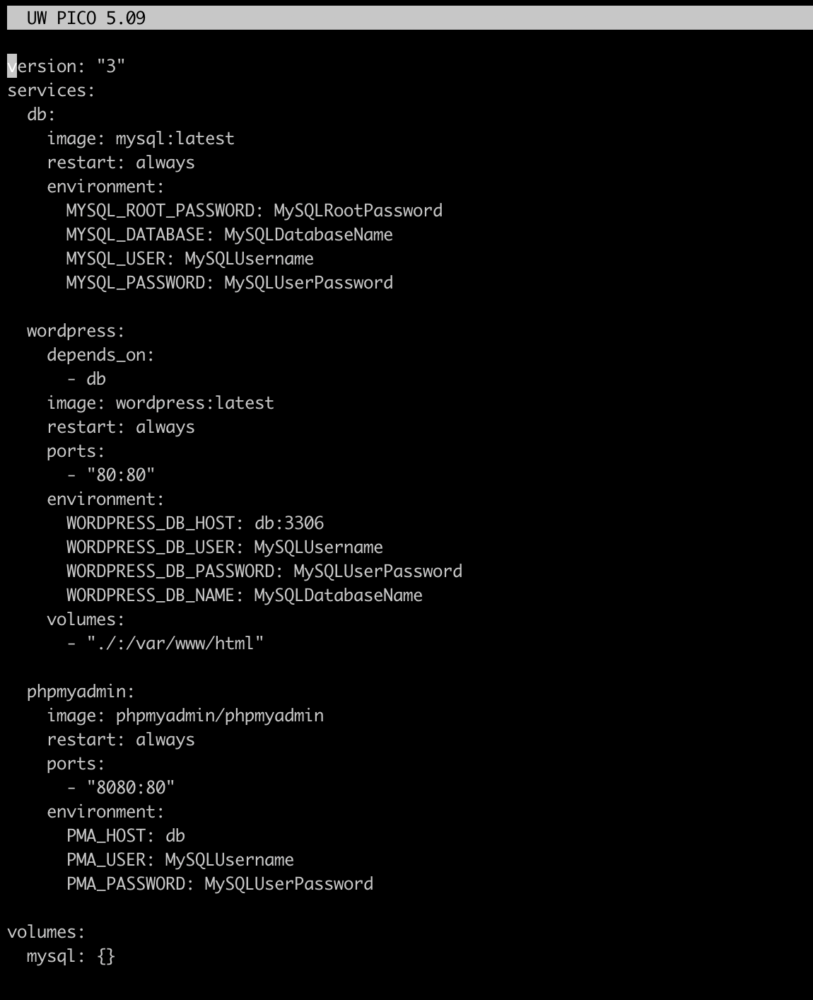
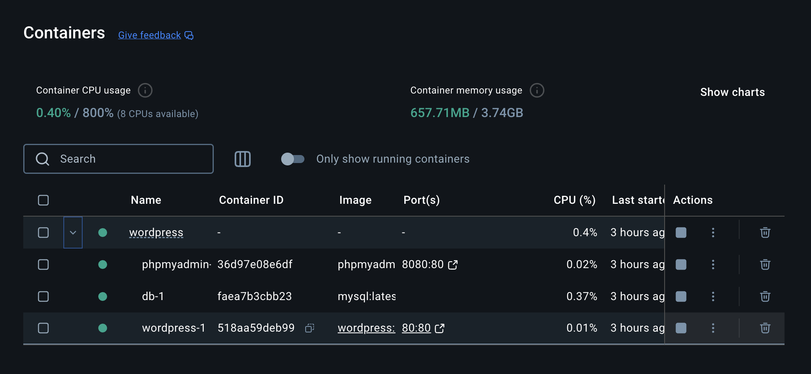
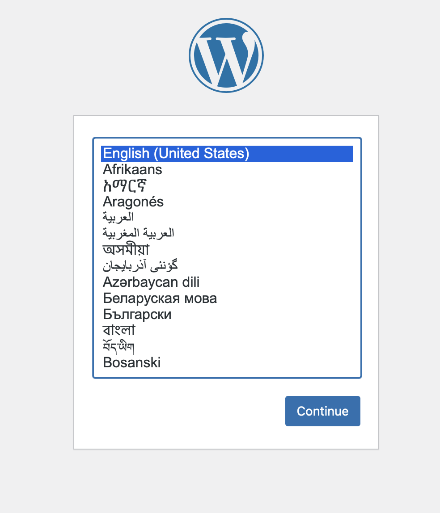
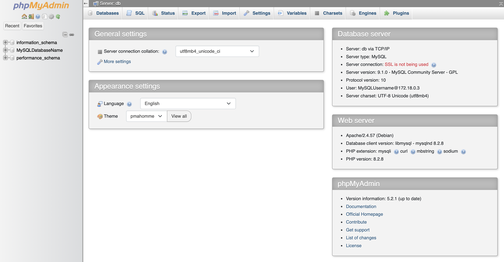
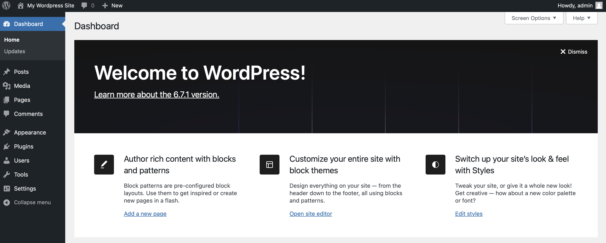

# Project 2: Creating a Wordpress Container with Docker

For this project, I referenced the Docker [documentation](https://docs.docker.com/desktop/setup/install/mac-install/) to install Docker Desktop to my laptop, and [this](https://www.hostinger.com/tutorials/run-docker-wordpress) source as a guide for creating a Wordpress container with Docker.

On my first attempt with this project, I installed Docker on a fresh Ubuntu VM, but had issues with Docker Compose (sorry, I don't have any screenshots). So on my second attempt, I decided to install Docker on my Macbook rather than troubleshoot the VM.

I downloaded `Docker.dmg` and used the commands listed in the documentation:
```
sudo hdiutil attach Docker.dmg
sudo /Volumes/Docker/Docker.app/Contents/MacOS/install
sudo hdiutil detach /Volumes/Docker
```


Figure 1

I then opened the Docker application GUI, and it redirected to a webpage and prompted me to create an account. I did so, and the webpage then redirected back to the Docker app.

I verified Docker Compose:


Figure 2

I created a Wordpress folder with `mkdir wordpress` inside my SysAdmin folder, then `cd`ed into it. Inside I create a Docker Compose file with `sudo nano docker-compose.yml`, a file which defines and manages Docker containers for an application, specifying how they should be built, connected, and configured.


Figure 3

I used the guide's docker-compose.yml code here; it recommended changing the username and password, but I didn't care enough to change it. This `docker-compose.yml` file sets up a WordPress website with a MySQL database and a phpMyAdmin interface. The `db` service runs a MySQL database, configured with a root password, a database name, and a user account. The `wordpress` service connects to the database to run the website, and `phpmyadmin` provides a web-based tool to manage the database, with ports configured for access (WordPress on port 80 and phpMyAdmin on port 8080).

With this file configured, I then ran `docker-compose up -d` inside the project directory to install and launch Wordpress in a container. Then, inside the Docker Desktop app, the container was visible:


Figure 4

Clicking on the `wordpress-1` port 80:80, or going to https://localhost:80, brought me to the new Wordpress page: 


Figure 5

The `phpmyadmin` port also can be visited via port 8080, and has information about the database:


Figure 6

I then followed the setup instructions to create an account, username and password, which brought me to the Wordpress Admin interface:


Figure 7


