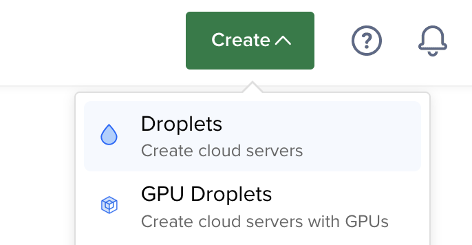
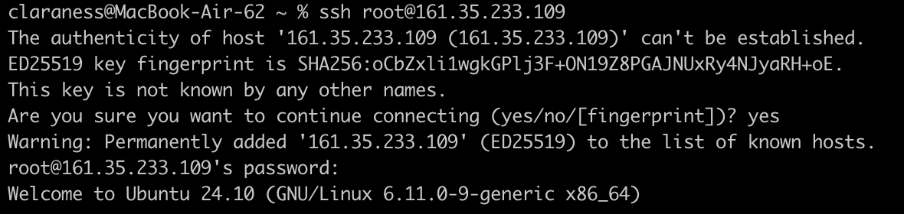
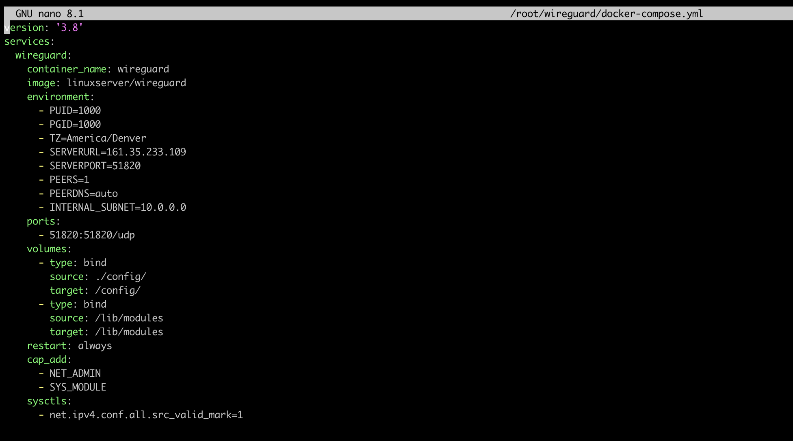
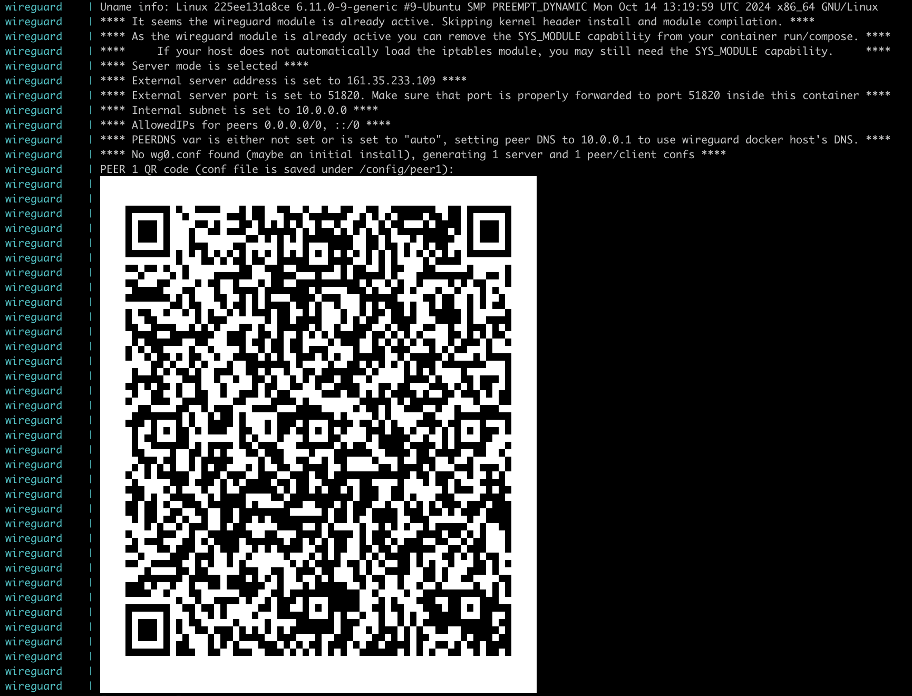
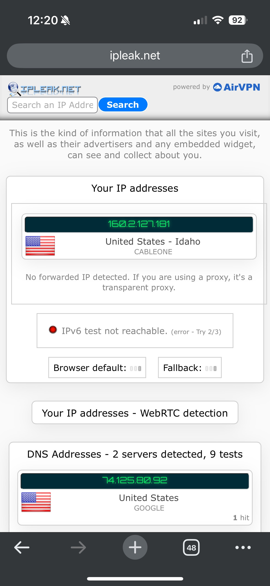
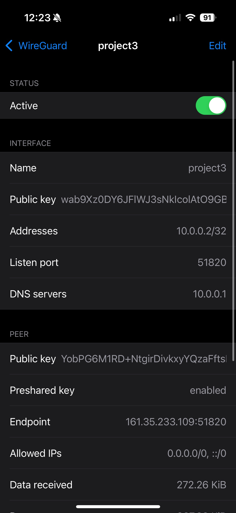
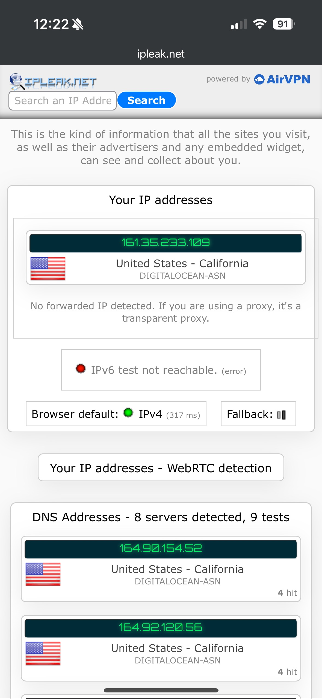
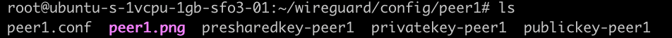

# Project 3: Creating a Wireguard VPN Using Digital Ocean and Docker

For this project, I referenced a few guides: to set up [Docker](https://thematrix.dev/install-docker-and-docker-compose-on-ubuntu-20-04/) and to set up [Wireguard](https://thematrix.dev/setup-wireguard-vpn-server-with-docker/).

To create a Digital Ocean droplet, I selected Create > Droplets at the top right of the Digital Ocean; then San Francisco as the region, with an Ubuntu OS, and the Basic Regular CPU, at $6/mo. I created a password, then selected Create Droplet at the bottom of the page. I then SSHed into the droplet with `ssh root@ip`, seen below.





To install Docker on the new droplet, I installed the necessary tools:

```bash
sudo apt install apt-transport-https ca-certificates curl software-properties-common -y
```

Added the Docker key:

```bash
curl -fsSL https://download.docker.com/linux/ubuntu/gpg | sudo apt-key add -
```


I did get a deprecation warning, but proceeded through the installation process with no issues despite the warning.

I then added the ARM 64bit repository, as I'm using a 64bit Apple Macbook for this project:

```bash
sudo add-apt-repository \
   "deb [arch=arm64] https://download.docker.com/linux/ubuntu \
   $(lsb_release -cs) \
   stable"
```


Then changed into the repo and installed Docker:
```bash
apt-cache policy docker-ce
sudo apt install docker-ce -y
```
Then, to install Docker Compose and set its permissions:
```
sudo curl -L "https://github.com/docker/compose/releases/download/1.27.4/docker-compose-$(uname -s)-$(uname -m)" -o /usr/local/bin/docker-compose
sudo chmod +x /usr/local/bin/docker-compose
```

Now, with setup of Docker on the droplet complete, I moved to setting up Wireguard. I first created a Wireguard directory and config directory, then a Docker Compose .yml file:
```bash
mkdir -p ~/wireguard/
mkdir -p ~/wireguard/config/
nano ~/wireguard/docker-compose.yml
```
Inside the .yml file, I pasted the text seen below:



Though most of this code came from the guide, I edited the TZ (timezone), SERVERURL (Droplet IP), and PEERS (number of users) variables to suit my needs.

I started the Wireguard container:
```
cd ~/wireguard/
docker-compose up -d
```

Then displayed Wireguard's live logs, including a QR code. This QR code will be used to connect to the Wireguard VPN.



I downloaded the Wireguard app on my phone, clicked `+` and `Create from QR code` before scanning the QR code. Then I turned the status of the new Wireguard tunnel to `Active`. This connected my phone to the VPN. The screenshots below show my IP before the VPN, the VPN's active status, and my IP after the VPN.







I then did a similar process to activate the VPN on my laptop. I copied the contents `/wireguard/config/peer1.conf` to clipboard, then pasted it into a new .conf file local to my computer.



I downloaded the Wireguard app to my laptop as well, then selected the `+`; instead of `Create from QR Code`, I selected `Create from file or archive`. I imported the .conf file, and again turned the new VPN's status to `Active`. The screenshots below show my laptop IP address before activating Wireguard, the tunnel's active status, and its IP after activation.


